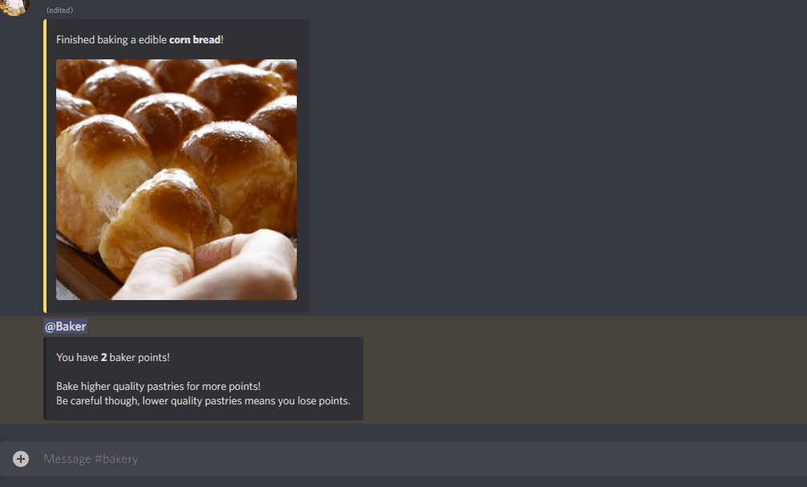
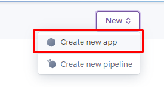
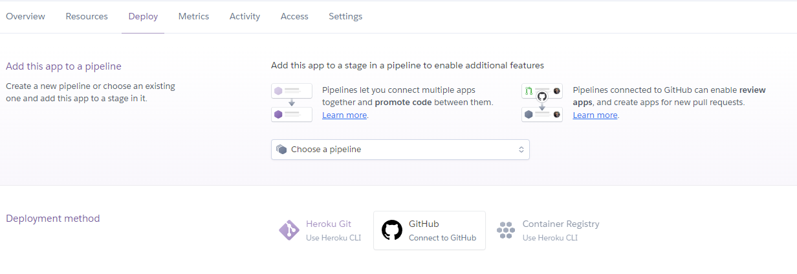
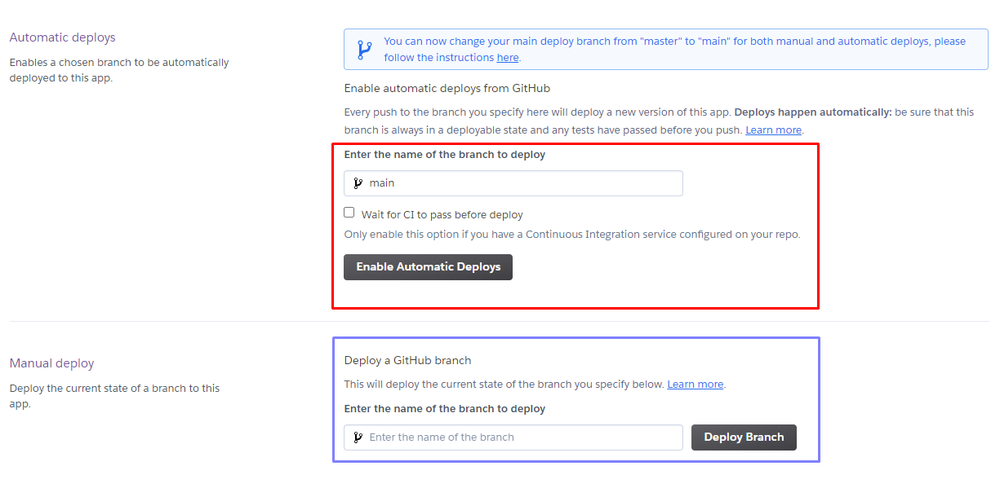
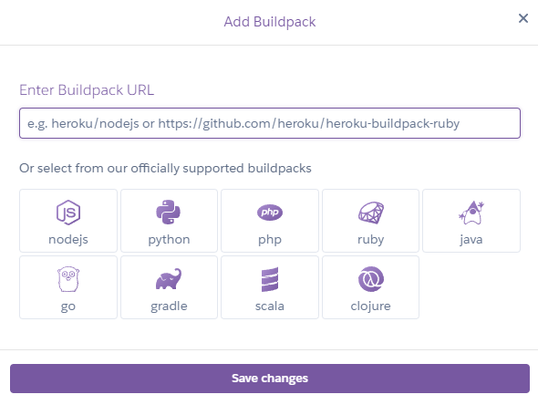

# Hosting Heroku-Baker



Running your app locally can be helpful for development, but once your app is ready for production and especially being added to more and more servers, you should consider using a hosting provider.

This tutorial will walk you through:
- Building and deploying a simple Discord app to Heroku
- How to manage your app with Heroku’s dashboard
- Maintenance and monitoring your app

## Table of Contents

* [Setting up Heroku](#setting-up-heroku)
* [Cloning and Configuring sample app](#cloning-and-configuring-sample-app)
* [Connecting Heroku to Github](#connecting-heroku-to-github)
* [Configuring app in Heroku](#configuring-app-in-heroku)
* [Maintenance and monitoring](#maintenance-and-how-to-monitor)

## Project structure

```
├── commands        -> sample commands
│   ├── breads.js
│   ├── cakes.js
│   ├── cookies.js
│   ├── pies.js
│   ├── createRoles.js
│   ├── setup.js
├── .env            -> sample .env file
├── index.js        -> main entrypoint for app
├── src    
│   ├── startup.js  -> slash command payload
│   ├── img
│   ├── handlers    -> utility functions
│   │   ├── rng.js
│   │   ├── cache.js
│   │   ├── oven.js
├── Procfile        -> heroku start
├── package.json
├── README.md
└── .gitignore
```

## Features

- Bakes bread (with varying degrees of success)
- Basic [slash command](https://discord.com/developers/docs/interactions/application-commands) handling
- [Buttons](https://discord.com/developers/docs/interactions/message-components#buttons)
- Caching system

## Requirements

- [Node](https://nodejs.org/en/)
- [NPM](https://www.npmjs.com/)
- [Discord.JS v13](https://discord.js.org/#/)
- [Discord-api-types](https://www.npmjs.com/package/discord-api-types)
- [@Discord.JS REST](https://www.npmjs.com/package/@discordjs/rest)
- [dotenv](https://www.npmjs.com/package/dotenv)

## Setting up Heroku
Next, you should set up an account for Heroku. Head over to https://www.heroku.com/ and log in to your account, or set up a new account if you don’t have one.



After logging in, at the top right corner of your account dashboard, click New > Create new app. You can then name it whatever you want.

## Cloning and Configuring sample bot
If you do not have your own application to deploy, you can continue to follow the steps in this readme.

If your application does not have a git repository set up, you can refer to the steps here to get that all set up: [LINK](https://git-scm.com/book/en/v2/Getting-Started-First-Time-Git-Setup)

### Prepping required components

```bash
# Clone the respository
git clone https://github.com/jcheonsa/heroku-baker

# Enter into the directory
cd baker-bot

# Install the dependencies
npm install .
```
First off, clone the sample-app. 

1) open/create the `.env` in Baker-bot's root directory
2) configure the `GUILD_ID` and `CLIENT_ID`
3) `npm install` will install all dependencies located in the package.json in a folder called node_modules

After cloning the project and installing all of the dependencies, you're going to need to add your Discord API `TOKEN` in the `.env` file as well as the `GUILD_ID` and `CLIENT_ID`. Your `.env` should include the following for this bot to operate properly:
```
TOKEN=
GUILD_ID=
CLIENT_ID=
```
https://discord.com/developers/applications to create your own Baker-bot clone and get your token.

>OAuth NOTE: Ensure that your app has the appropriate scopes for `application.commands` and `bot`.

```bash
# Procfile contents (startup)
worker node index.js
```
Then **create a new file called `Procfile`** where you will add a short script that Heroku will run when starting up your app. 
> The script in your `Procfile` will vary depending on what language you're coding in.

## Connecting Heroku to GitHub



After creating the application in Heroku, you will be met with some options in the *Deploy* tab. From here, you have several deployment method options to choose from, we'll look to **Connect this app to GitHub**.
 
>NOTE that you can only connect Heroku apps to a single GitHub repository. 

From there, you will be able to manage the app's deployment method:



Selecting a branch and enabling **Automatic Deploys** for your app will deploy a new version of this app every time a push occurs. **Manual Deploys** would require you to select a specific branch before updates go live for your bot. 

>If you want to do this with the Heroku CLI, there are separate steps in the dashboard you can follow to accomlish this as well. [LINK](https://devcenter.heroku.com/articles/heroku-cli)

## Configuring app in Heroku

Before your app can go online, you'll have to configure your Heroku environment with your Discord bot's credentials.

Config vars allow you to set environment-specific variables and configurations for the app. These will persist throughout the different guilds your bot is operating in, and make it so you won’t need to store these variables in source code. Additionally, all config vars are encrypted. With that said, add your bot’s `TOKEN` and any other tokens or API keys it may require to operate properly to the list of config vars.


You'll notice that there isn't anything you have to change in your source code. Amazin'



The next step is to **add a buildpack to your app**. The buildpack is responsible for compiling your deployed code and installing any dependencies, meaning the one you select will also depend on how you built your bot.

## Maintenance and how to monitor

You'll notice a new window in the dashboard once you have successfully connected your app to your bot's repo. A **Dyno** is a virtualized Linux container that executes the code in `Procfile` - think of it as a mini computer dedicated to running your bot. By default, Heroku gives 550 free dyno hours per application per month. [This is just enough to keep your bot online 24/7] If your app will need additional hours, you can look at Heroku's [pricing page](https://www.heroku.com/pricing).


Status and updates for the dyno, any deploys as well as specific logs from your bot will be available in the **View Logs** tab. if a shard ever goes off or your bot crashes, the app will automatically restart. These events will also be [logged](https://devcenter.heroku.com/articles/logging).


Congratulations, your bot is now ready to go live!